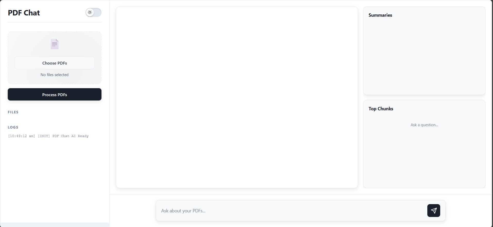
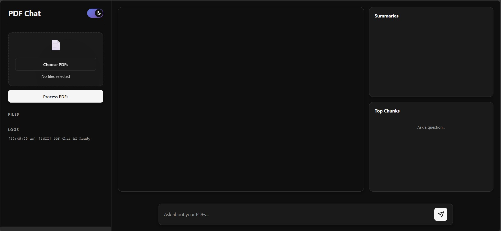
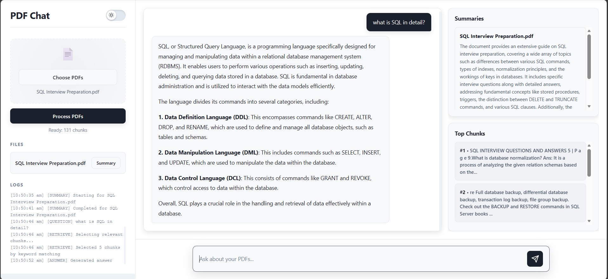
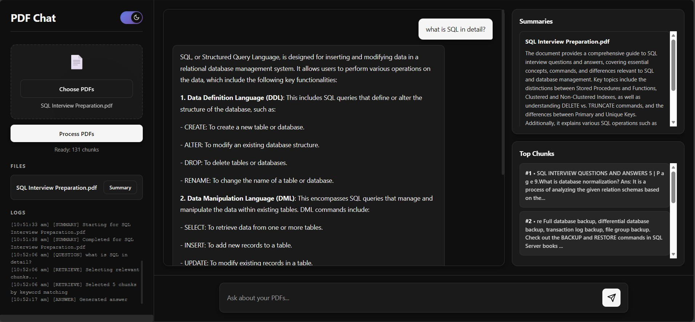
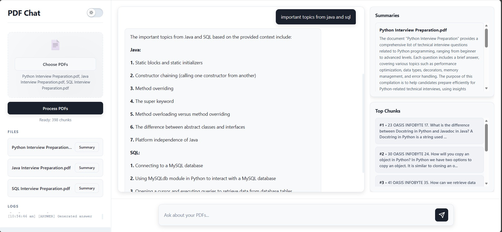
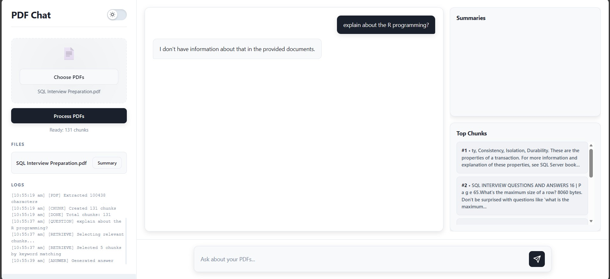

# Chat With PDF (PDF Chat) - RAG-Based Document Question Answering System

**Chat With PDF** is a web-based application that allows users to upload PDF documents, extract their content, and interact with them using a Retrieval-Augmented Generation (RAG) pipeline.
The system retrieves the most relevant chunks from uploaded PDFs and generates accurate, context-aware responses using Puter AI (gpt-4o-mini).

**To use this website, you only need a free Puter account. No installation or setup is required.**

Live website: **[https://gurumahesh23.github.io/Chat-With-PDF/](https://gurumahesh23.github.io/Chat-With-PDF/)**

The interface includes multi-file support, AI summaries, chunk previews, real-time logs, and a modern UI with both light and dark themes.

---

## **Key Features**

### **PDF Upload & Processing**

* Supports multiple PDF files.
* Extracts clean text using PDF.js.
* Handles drag-and-drop uploads.

### **Intelligent Chunking**

* Splits text into ~900-character segments.
* Ensures efficient retrieval and minimized context loss.

### **RAG Question Answering**

* Keyword-based chunk retrieval.
* AI retrieval fallback when keywords fail.
* Answers generated strictly from retrieved chunks (no hallucination).

### **AI Summaries**

* Generates concise summaries (3-5 sentences) for each PDF.

### **User Interface**

* Professional light and dark themes.
* Chunk preview modal.
* Real-time logs panel.
* Dedicated summary and top-chunk sections.

---

## **Technology Stack**

| Layer            | Technology                    |
| ---------------- | ----------------------------- |
| Frontend         | HTML, CSS, JavaScript         |
| PDF Parsing      | PDF.js                        |
| AI Model         | Puter AI (gpt-4o-mini)        |
| Retrieval Method | Keyword scoring + AI fallback |
| UI Enhancements  | Modal windows, theme toggling |

---

## **System Architecture**

### **1. PDF Extraction**

Documents are processed using PDF.js, extracting text page by page.

### **2. Chunking**

The extracted text is divided into semantically cohesive chunks (~900 characters) to improve retrieval accuracy.

### **3. Retrieval**

* **Primary:** Keyword matching across all chunks
* **Secondary:** AI-assisted relevance selection when keyword matches are insufficient

The system displays relevant chunks to ensure transparency.

### **4. Response Generation**

The AI model generates answers **only using retrieved context**.
If no relevant information exists, a fallback message is shown.

### **5. UI Rendering**

The interface provides dedicated sections for:

* Chat
* File list
* Document summaries
* Top retrieved chunks
* Logs
* Chunk preview modal

---

## **Usage**

1. Upload one or more PDF files.
2. Click **Process PDFs** to extract and chunk the documents.
3. Click **Summary** to generate a condensed overview.
4. Login with Puter Account
5. Ask questions in the input box.
6. Review relevant chunks and logs for transparency.

---

## **Screenshots**

### **Main Interface - Light Theme**



### **Main Interface - Dark Theme**



### **Example Interaction - Light Theme**



### **Example Interaction - Dark Theme**



### **Multiple PDF Handling**



### **Response When Information Is Not in PDF**



---

## **Folder Structure**

```
Chat-With-PDF/
│── index.html
│── style.css
│── app.js
│── README.md
│
└── assets/
    └── images/
        ├── main_lighttheme.jpg
        ├── main_darktheme.jpg
        ├── example_lighttheme.jpg
        ├── example_darktheme.jpg
        ├── multifileshandling.jpg
        └── aprtfromPDFinfo.jpg
```

---

## **Use Cases**

* Academic research
* Technical documentation analysis
* Interview preparation
* Legal and policy document review
* Personal knowledge extraction
